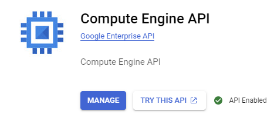

# **Setup Hadoop Cluster (GCP)**

## **Note**
(Optional) We Suggest You To Create A New Project In GCP Which Makes Easy Maintain Instances At a Project Level


<hr>

## **Enabling Compute Engine API**
Enable Compute Engine API To Be Able To Create Compute Instances


<hr>

## **Creating Instances**
Recommended Number of Instances: Three - (3)
- master-node
- node-1
- node-2

**Note:** Repeat Installation Steps On All Nodes
```
sudo apt-get update
```
Install Java
```
sudo apt-get install openjdk-8-jdk
````
Download Hadoop of Your Choice
```
wget https://dlcdn.apache.org/hadoop/common/hadoop-2.10.2/hadoop-2.10.2.tar.gz
```
Unzip
```
tar xvzf hadoop-2.10.2-src.tar.gz
```
<hr>

